### 收费版

1. 选择第三方公司搭建好了的机场，其特点是稳定、速度快、安装和管理相对简单，缺点就是费用相对搞一些，但是一个账号**同时**允许五台设备在线[设备台数不限]，所以多人共享一个账号，也是一个不错的选择[建议五个人]。

   - 平台选择

     - BoomCloud:https://www.boomsss.com/cart.php


       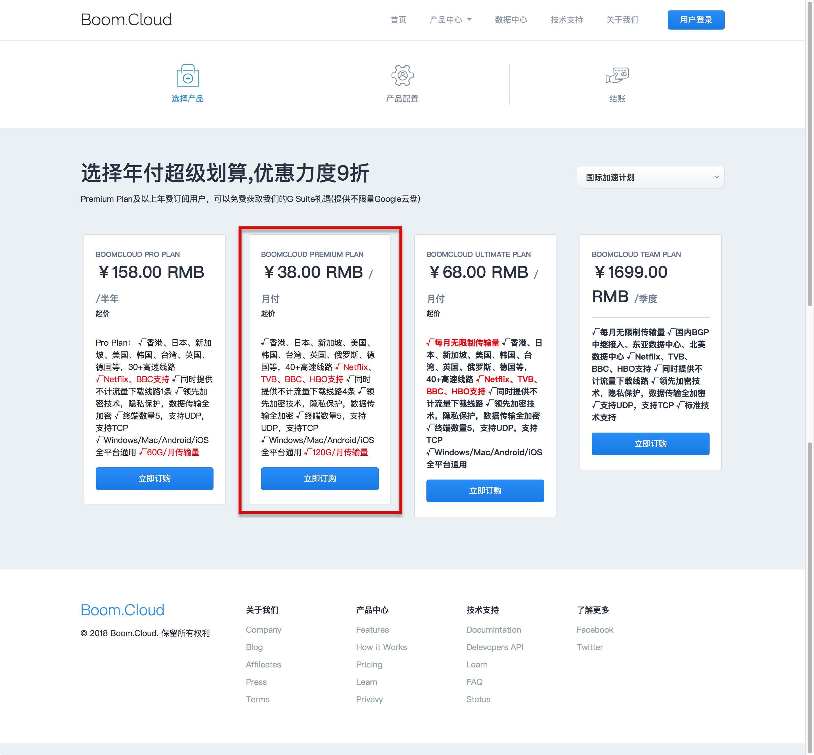


       点击“立即订购”，如下图所示，图中输入自己的密码，其余的默认即可，然后单击 “继续”：

       


       在用户注册页面填写自己的基本信息，其中 “邮件地址” 是自己的**用户名**，密码和上个页面填写的密码保持一致：

       

       勾选统一服务条款，点击 “完成订购”：

       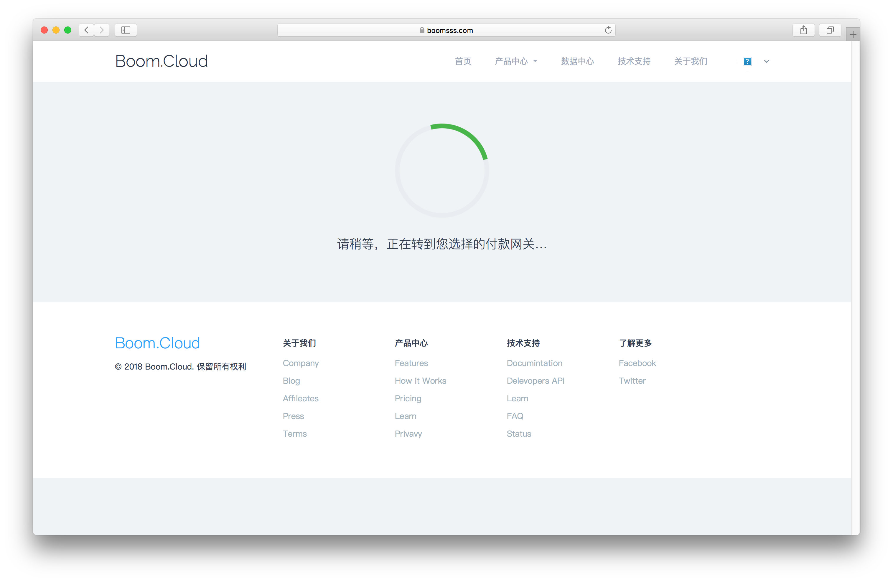


       页面会自动跳转到支付界面，此时账号已经注册成功，并自动登录，接下来要做的就是扫码登录了，该平台支持支付宝支付：

       

       付款成功之后，将跳转到如下界面，此时平台为我们自动生成了一个产品，点击进去即可查看详情：

       

       如图所示，该页面展示的就是我的产品配置信息，一共54条线路，可根据自己的需求，选择一条网速最快的线路进行资源访问 [推荐使用**香港优化线路3**]。

       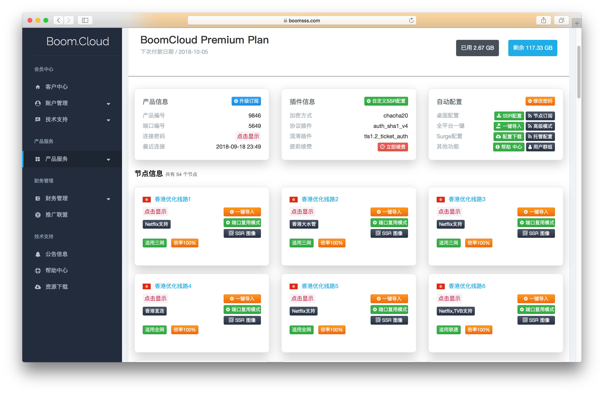

   - 产品的使用

     该平台为为 Windows 和 MacOS 平台提供了定制化客户端，使用起来非常方便，Linux 平台无客户端，需要进行单独的配置，下面我们一一介绍对于不太的平台，如何使用我们购买的云加速服务器。

     客户端下载链接：https://www.boomsss.com/downloads.html

     

     - Windows

       安装过程如下：

       

       安装过程中勾选 “Create a desktop shortcut” 来创建桌面快捷方式：

       

       一直下一步，安装完成后会有一个如下图所示的报错界面，直接点确定：

       

       此时我们的桌面上会多出来一个名为 **【BoomCloud】**的快捷方式，右键 -> 以管理员身份运行：

       

       **用户名**和**密码**填写我们注册的账号即可，登录成功后客户端会自动同步云加速服务器配置，并将客户端收进右下角的任务栏，如下图所示：

       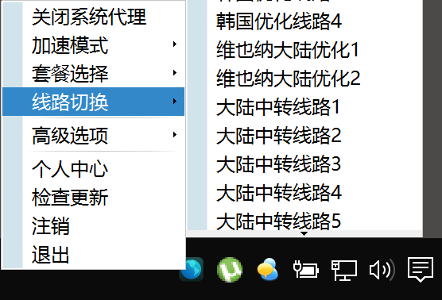


       接下来就可以访问绿墙以外的资源了：

       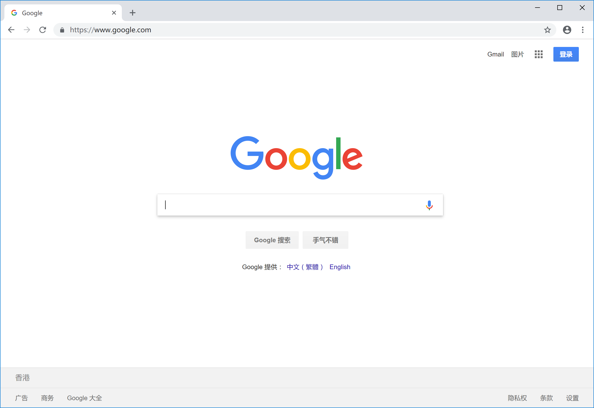

     - MacOS

       客户端安装安装完成之后，能够在 Launchpad 中找到该客户端：

       

       点击运行之后，会调到我们的登录界面：

       

       **用户名**和**密码**填写我们注册的账号即可，登录成功后客户端会自动同步云加速服务器配置，并将客户端收进顶端任务栏，如下图所示：

       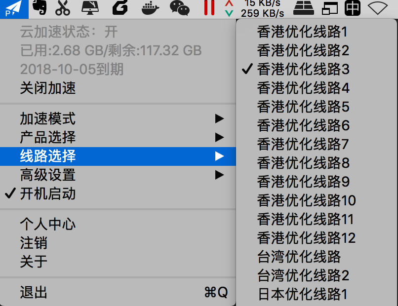


       接下来就可以访问绿墙以外的资源了：

       

     - Linux

       该平台没有提供 Linux 系统下的客户端，我们可以通过修改配置文件来达到同样的效果。

       #### 配置 SSR 客户端

       > Shadowsocks 与 Shadowsocksr 区别： SS是原版，SSR是原版基础上衍生出来的第三方版本，兼容原版协议，比原版多了一些伪装功能（协议和混淆）。 SSR 主要特点是增加了一些人性化功能，比如服务器连接统计、连接管理、协议转换、多重代理等。

       **1、下载 ssr 客户端**

       ```shell
       git clone https://github.com/ssrbackup/shadowsocksr
       ```

       **2、配置 ss 文件**

       进入刚刚 clone 下来的文件夹，有一个文件叫 config.json,这是配置文件的模板，复制一份到  `/etc/shadowsocks.json`

       ```shell
       cp config.json /etc/shadowsocks.json
       ```

       然后对这个文件进行配置：

       ```shell
       sudo gedit /etc/shadowsocks.json
       ```

       用下面的替换该文件中的内容（具体的服务器地址，端口，密码，加密方式，协议插件 ）

       ```json
       "server": "0.0.0.0", 
           "server_ipv6": "::",
           "server_port": 80890,
           "local_address": "127.0.0.1",
           "local_port": 1080,
       
           "password": " ",
           "method": "chacha20",
           "protocol": "auth_sha1_v4",
           "protocol_param": "",
           "obfs": "http_simple",
           "obfs_param": "",
           "speed_limit_per_con": 0,
           "speed_limit_per_user": 0,
       
           "additional_ports" : {}, mode
           "additional_ports_only" : false,multi-user mode
           "timeout": 120,
           "udp_timeout": 60,
           "dns_ipv6": false,
           "connect_verbose_info": 0,
           "redirect": "",
           "fast_open": false
       ```

       主要用到的配置是下面的这几个选项：

       ```json
       "server": "0.0.0.0",    # 服务器地址对于ss：ping+域名，得到地址。
       "server_port": 1234,    # 端口
       "password": " ",        # 密码
       "method": "chacha20",        # 加密方式
       "protocol": "auth_sha1_v4",  # 协议插件
       "obfs": "http_simple",       # 混淆插件
       ```

       配置项的具体值我们可以在我们的匀加速服务器中导出配置文件获取


       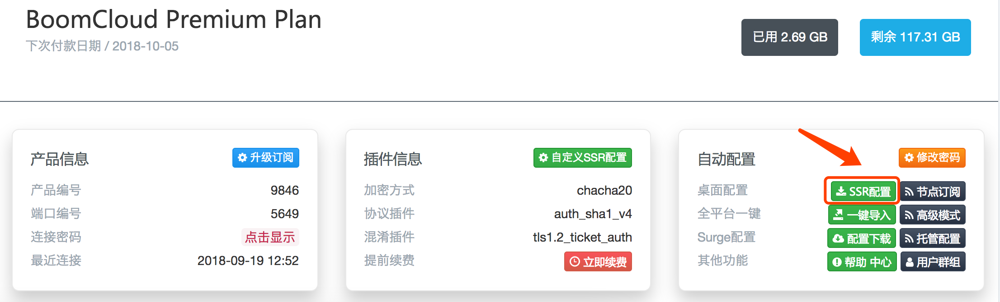


       打开配置文件下载的配置文件即可查看我们的配置文件

       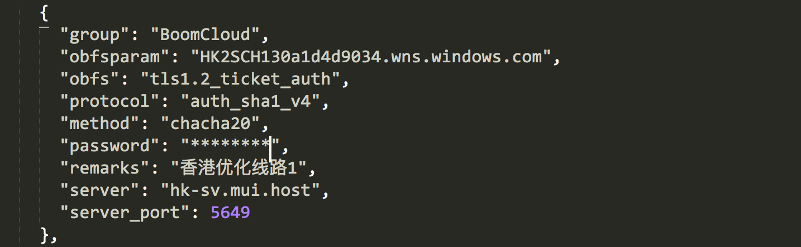

       **3、启动 ssr 客户端**

       ```shell
       python ~/shadowsocksr/shadowsocks/local.py -c /etc/shadowsocks.json 
       ```

       **注：**如果出错：

       ```python
       IPv6 support
       Traceback (most recent call last):
         File "local.py", line 81, in <module>
           main()
         File "local.py", line 43, in main
           config = shell.get_config(True)
         File "/home/miliimoulins/shadowsocksr/shadowsocks/../shadowsocks/shell.py", line 299, in get_config
           check_config(config, is_local)
         File "/home/miliimoulins/shadowsocksr/shadowsocks/../shadowsocks/shell.py", line 129, in check_config
           encrypt.try_cipher(config['password'], config['method'])
         File "/home/miliimoulins/shadowsocksr/shadowsocks/../shadowsocks/encrypt.py", line 46, in try_cipher
           Encryptor(key, method)
         File "/home/miliimoulins/shadowsocksr/shadowsocks/../shadowsocks/encrypt.py", line 90, in __init__
           random_string(self._method_info[1]))
         File "/home/miliimoulins/shadowsocksr/shadowsocks/../shadowsocks/encrypt.py", line 119, in get_cipher
           return m[2](method, key, iv, op)
         File "/home/miliimoulins/shadowsocksr/shadowsocks/../shadowsocks/crypto/sodium.py", line 71, in __init__
           load_libsodium()
         File "/home/miliimoulins/shadowsocksr/shadowsocks/../shadowsocks/crypto/sodium.py", line 42, in load_libsodium
           raise Exception('libsodium not found')
       Exception: libsodium not found
       ```

       因为当前Python版本为系统自带python 2.7，缺很多东西。将python默认版本改为anaconda python 3（安装见[系列3](https://www.jianshu.com/p/fe2c3c5c1067)，推荐用这个），这是一种临时修改python默认版本的方法:

       ```shell
       export PATH=~/anaconda3/bin:$PATH
       source ~/.bashrc
       ```

       【如果直接修改python默认版本为anaconda3： `sudo gedit ~/.bashrc` 在最后一行添加： `export PATH=~/anaconda3/bin:$PATH` ，保存。然后：`source ~/.bashrc`】
        然后再执行： `python ~/shadowsocksr/shadowsocks/local.py -c /etc/shadowsocks.json` ，成功：

        ```shell
       IPv6 support
       2018-04-20 15:53:35 INFO     util.py:85 loading libsodium from /home/miliimoulins/anaconda3/lib/libsodium.so.23
       2018-04-20 15:53:35 INFO     local.py:50 local start with protocol[auth_sha1_v4] password [b'jfahtt'] method [chacha20] obfs [http_simple] obfs_param []
       2018-04-20 15:53:35 INFO     local.py:54 starting local at 127.0.0.1:1080
       2018-04-20 15:53:35 INFO     asyncdns.py:324 dns server: [('127.0.0.1', 53)]
        ```

       4、转换 HTTP 代理

       Shadowsocks默认是用Socks5协议的，对于Terminal的get,wget等走http协议的地方是无能为力的，所以需要转换成http代理，加强通用性，这里使用的转换方法是基于Polipo的。

       ```shell
       sudo apt-get install polipo      # 安装Polipo
       sudo gedit /etc/polipo/config    # 修改配置文件
       ```

       将下面的内容整个替换到文件中并保存：

       ```shell
       # This file only needs to list configuration variables that deviate
       # from the default values. See /usr/share/doc/polipo/examples/config.sample
       # and "polipo -v" for variables you can tweak and further information.
       logSyslog = false
       logFile = "/var/log/polipo/polipo.log"
       
       socksParentProxy = "127.0.0.1:1080"
       socksProxyType = socks5
       
       chunkHighMark = 50331648
       objectHighMark = 16384
       
       serverMaxSlots = 64
       serverSlots = 16
       serverSlots1 = 32
       
       proxyAddress = "0.0.0.0"
       proxyPort = 8123
       ```

       重启Polipo:

       ```shell
       /etc/init.d/polipo restart
       ```

       验证代理是否正常工作：

       ```shell
       export http_proxy="http://127.0.0.1:8123/"
       curl www.google.com
       ```

       5、配置浏览器

       之前参考别人的方法来配置了firefox，it worked，但是到了chrome方法就不适用了。我们可以直接来**修改全局网络**。

       打开`system settings->network->network proxy` ： `Method:Manual` 

       下面都设置为：`127.0.0.1` 端口：`8123` 

       点击 `Apply system wide`


       **Done!**

        

       **注意：**每次开机后都要执行：`python ~/shadowsocksr/shadowsocks/local.py -c /etc/shadowsocks.json` 来启动ss服务。
        有时候不走运的话，误杀该进程（关机 或者关闭当前terminal 或者ctrl z当前python进程）会发生非常烦人的事：内网外网都上不了，重启也没用，会提示你：

        ```shell
       curl: (7) Failed to connect to 127.0.0.1 port 8123: Connection refused
        ```

       **Solution：**

       - 首先一般这种情况下，如果你不是直接关闭的当前terminal，则你的Python进程可能还没有杀掉，所以 `ps aux|grep python`，然后`kill -9 process_number`（那个python进程的process number）。
       - 然后重新启动ss服务。ps：我**建议用screen命令来执行**，至少不用担心误杀进程：`screen python ~/shadowsocksr/shadowsocks/local.py -c /etc/shadowsocks.json`。pps：screen模式下，`ctrl+a`，然后`d`（detach），或者直接可以关闭当前terminal。
       - **如果还是不能上网：** 重启polipo： `/etc/init.d/polipo restart`。
       - 验证：`export http_proxy="http://127.0.0.1:8123/"`， `curl www.google.com`。

       ##### 6、Ubuntu开机后自动运行

       现在可以科学上网了，可是每次开机都要手动打开终端输入命令，虽然命令并不长，但是每次都去手动输入，显得自己很low，而且关掉终端代理就关闭了（如果不是用的screen命令），还会引发上面一系列问题。

       **Solution：**

       - **写个脚本**

        我们可以在比如`/home`下新建个文件叫做`shadow.sh`，在里面写上我们启动ssr客户端需要的命令，然后保存即可。因为有时候会遇到启动ss服务后依旧内网外网都不能上，就每次都自动重启一下polipo吧：

       ```shell
       #！/bin/bash
       #shadow.sh
       screen python ~/shadowsocksr/shadowsocks/local.py -c /etc/shadowsocks.json
       /etc/init.d/polipo restart
       ```

       【 如果用的不是screen， 直接python的话：这个时候你虽然输入的少了，可是关了终端还是会掉的，我们可以让它在后台运行，`nohup sh /home/shadow.sh &` 。】

        **至此**：开机后打开终端运行：`sh /home/shadow.sh`，就可以自由上网了。

        

### 免费版

1. 目前免费版的很不稳定，常用的资源可以访问，但是部分资源会出现连接超时的问题，所以不建议使用

   - 目前免费版还可以使用的资源不多，用的最多的就是蓝灯了，下面给大家附上下载链接

   Windows：

   MacOS:

   Linux：

   ​	下载链接：

   ​	<https://github.com/z847299324/ssr.git> 	

   - 使用方法：

   将相应平台的客户端安装成功之后，双击运行，就可以通过浏览器访问国外资源了。但是Linux系统的终端走的是SOCKS协议，我们还需要单独设置一下代理，让我们的终端走 http 协议，具体设置方式如下：

   ​	如下图所示，点击 “Show Lantern”:

   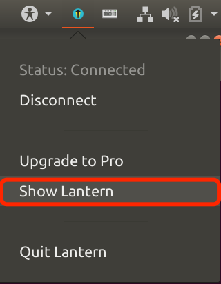


   ​	此时系统默认浏览器会被打开，接下来的操作如下图所示：

   

   

   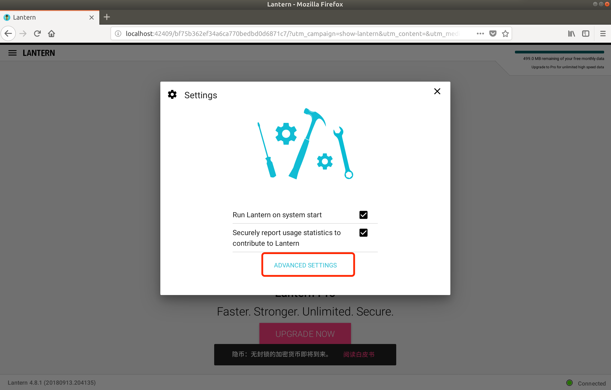

   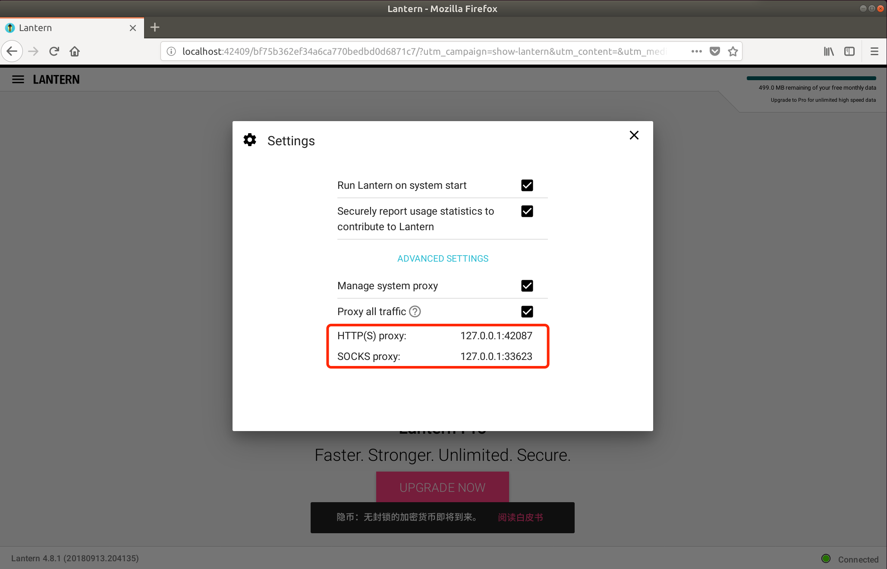


   在上面的操作中，我们已经获得了 HTTP(s) 和 SOCKS 代理的端口号，我们需要将他们设置在我们的终端配置文件中：vim ~/.bashrc

   ```shell
   export http_proxy="http://127.0.0.1:42087/"
   ```

   此时我们终端就可以通过访问国外资源了，验证：在我们的终端中输入如下指令：

   ```shell
   curl www.google.com
   ```

   如果终端中输出 google 官网首页的源代码，说明设置成功。


   ​	

